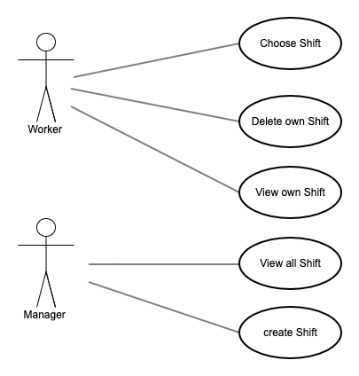
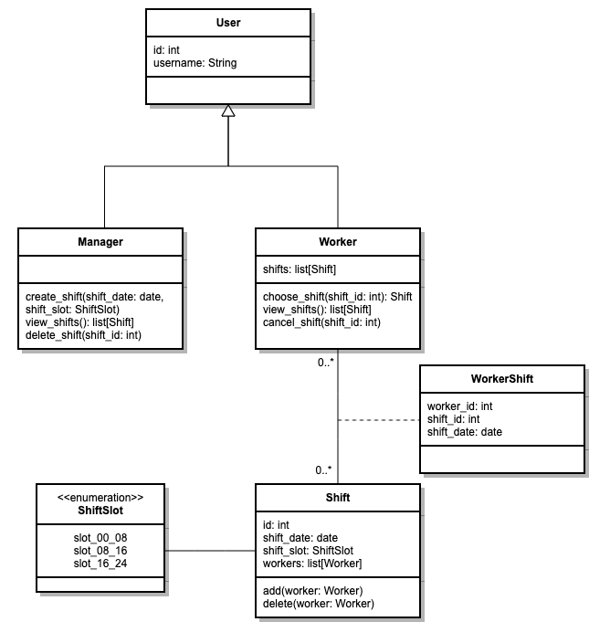
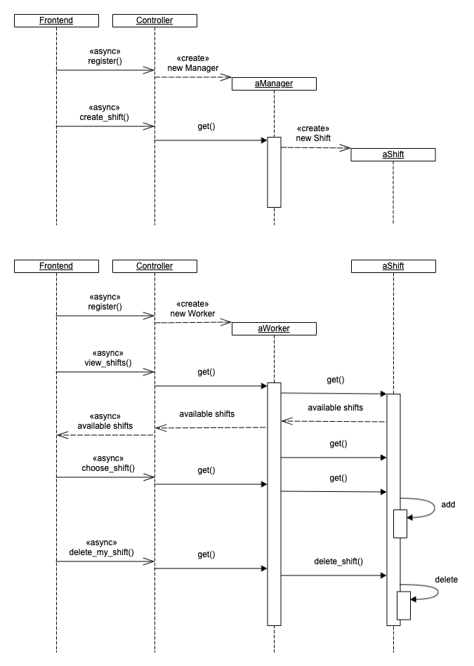
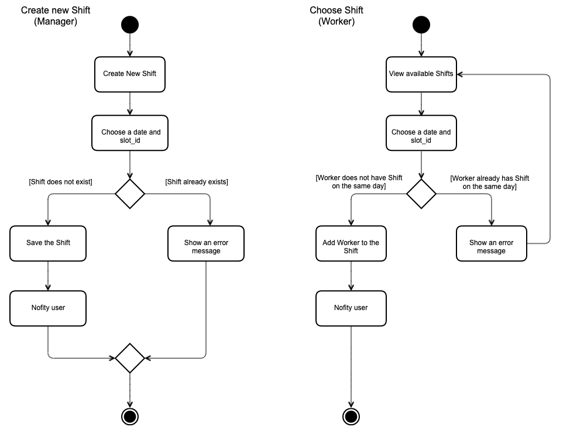

# Shifts

Simple REST API application that can serve as a work planning service

## Technologies used

- [FastAPI](https://fastapi.tiangolo.com/)
    - [pydantic](https://pydantic-docs.helpmanual.io/)
    - [SQLAlchemy](https://www.sqlalchemy.org/)
    - [Alembic](https://alembic.sqlalchemy.org/en/latest/)
- [PostgreSQL](https://www.postgresql.org/)
- [pytest](https://docs.pytest.org/)

## Requirement analysis

The requirements for the application are as follows.

### Functional requirements

- The application must store Shifts by multiple Workers.
- A Shift must be 8 hours long (slots: 0-8, 8-16, 16-24).
- A Worker must have zero or more Shifts over multiple days.
- A Worker must have zero or one Shift per day.
- The application must provide REST APIs.

### Assumptions

In addition, the following assumptions have been made:

- Manager can create Shifts.
- Workers can choose Shifts.
- Workers can cancel their Shifts.


### Out of scope functionality

The following functionality is out of scope in the current version.

- Authentication (signup, login)
- Authorisation 
- Front-end application

## Application design

The overview of the application design is as follows.

### Actors

- Worker
- Manager

### Use stories and use cases

- As a Worker, I want to choose a Shift so that Manager can see when I work.
- As a Worker, I want to cancel my Shift so that another worker can choose the Shift.
- As a Manager, I want to view all Shifts so that I can make staffing plans.
- As a Manager, I want to create Shifts so that Workers can choose them.



### Class diagram

There are two main points to consider.

1. Worker and Manager have common attributes, such as `username`. Therefore, it would be convenient
   to consider that they are subclasses of a parent class `User`. 

2. A `Worker` can have multiple `Shift`s, and a `Shift` can have multiple `Worker`s. 
   Therefore, the relationship between `Worker` and `Shift` is considered many-to-many. 
   Implementing this relationship would require an association class `WorkerShift` that connects `Worker` and `Shift`.

To summarise, the class diagram is shown below.



### Sequence diagram

Although the front end is not included in this application, the following sequence diagrams
show how the objects would interact with each other.



### Activity diagram

The following diagrams show some of the primary activities' flow.



## Implementation

The application is built using the [FastAPI](https://fastapi.tiangolo.com/) framework.

### Models

The following Pydantic models (`src/shifts/app/schemas` directory in the repository) are implemented based on the class diagram shown above.

- `User`
- `Worker`
- `Manager`
- `Shift`
- `WorkerShift`

As discussed earlier, `Worker` and `Manager` inherit from `User`. `WorkerShift` works as an association class that connects `Worker` and `Shift`.

The classes are mapped to the database tables using SQLAlchemy ORM. They are stored in the `src/shifts/app/models` directory in the repository.

### Routers

The application has the following REST API endpoints, defined in the `src/shifts/app/api` directory.

- `worker`
- `manager`
- `shift`

FastAPI automatically generates the Open API documentation, which lists all the APIs.

## Deployment

The application can be run in a Docker environment. Run the `docker-compose` command at the root of the directory.

```
$ docker-compose up -d
```

This command will build the necessary Docker images and start the application and the PostgreSQL database server. It will also add a few initial test records to the tables.

The Open API document is accessible at [`http://localhost:8001/docs`](http://localhost:8001/docs), which can be used to access the APIs.
