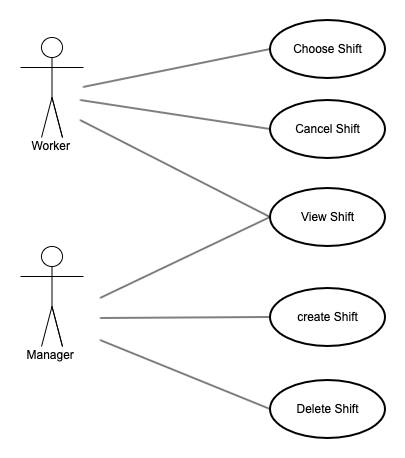

# Shifts

This is a simple REST API application that can serve as a work planning service.

## Technologies used

- [FastAPI](https://fastapi.tiangolo.com/)

    - [pydantic](https://pydantic-docs.helpmanual.io/)
    - [SQLAlchemy](https://www.sqlalchemy.org/)
    - [Alembic](https://alembic.sqlalchemy.org/en/latest/)

- [PostgreSQL](https://www.postgresql.org/)
- [pytest](https://docs.pytest.org/)

# Requirement analysis

The requirements for the application are as follows.

## Functional requirements

- The application must store Shifts by multiple Workers.
- A Shift must be 8 hours long (slots: 0-8, 8-16, 16-24).
- A Worker must have zero or more Shifts over multiple days.
- A Worker must have zero or one Shift per day.
- The application must provide REST APIs.

## Assumptions

In addition, the following assumptions have been made:

- Manager can create Shifts.
- Workers can choose Shifts.
- Workers can delete their own Shifts.

## Out of scope functionality

The following functionality is not included in the current version.

- Authentication (signup, login)
- Authorisation 

# Application design

The overview of the application design is as follows.

## Actors

- Worker
- Manager

## Use stories and use cases

- As a Worker, I want to choose a Shift, so that Manager can see when I work.
- As a Worker, I want to delete my Shift, so that another worker can choose the Shift.
- As a Manager, I want to view all Shifts, so that I can make staffing plans.
- As a Manager, I want to create Shifts, so that Workers can choose them.

## Class diagram

There are two main points to pay attention to.

1. Worker and Manager have common attributes, such as `username`. Therefore, it would be convenient
   to consider that they are a subclass of a parent class `User`. 

2. A `Worker` can have multiple `Shift`s and a `Shift` can have multiple `Worker`s. 
   Therefore, the relationship between `Worker` and `Shift` is considered as many-to-many. 
   In order to implement this relationship, it would be necessary to implement an association class `WorkerShift` that connects `Worker` and `Shift`.

To summarise, the class diagram is shown below.

## Sequence diagram

Although the front end is not included in this application, the following sequence diagrams
show how the objects would interact with each other.

## Activity diagram

The following diagrams show some of the flow of some of the basic activities.

